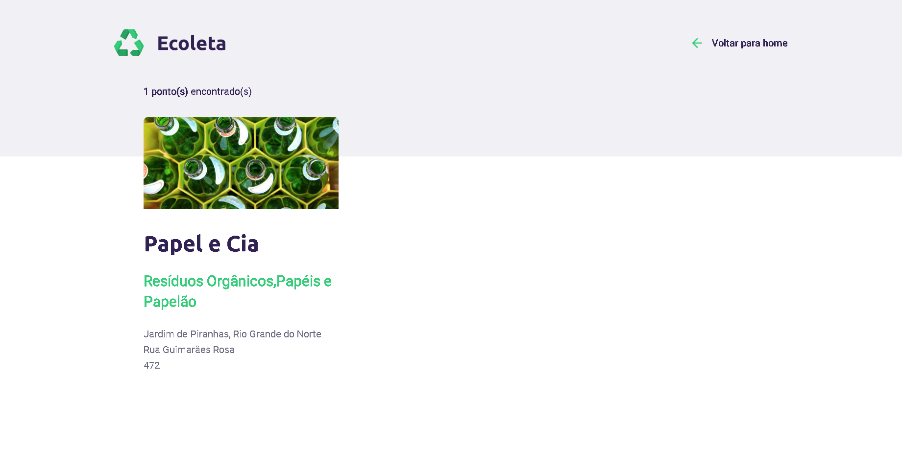

# :rocket: Next-Level-Week :beginner:

O repositório tem como objetivo registrar o conhecimento obtido durante toda a semana. Todos os códigos envolvidos estão comentados de maneira a se extrair o máximo de informação possível das aulas.

# :page_with_curl: Pages

Home

Create Point

Registration completed successfully

Collection Points

Search Results
